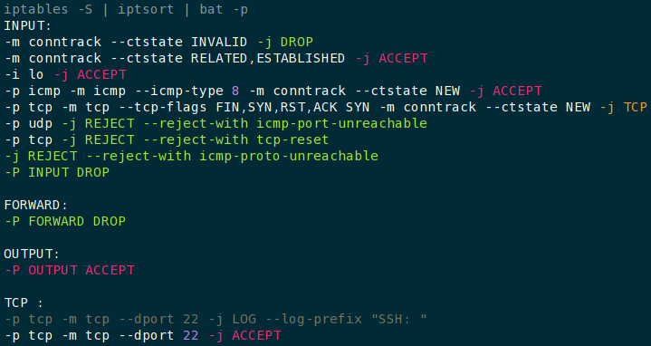

# iptables -S | sorted | colored

Sort and color the output of `iptables --list-rules`

## implementation

- download iptsort bash script in `/usr/local/bin/`
- after verification, make it executable with `chmod +x /usr/local/bin/iptsort`
